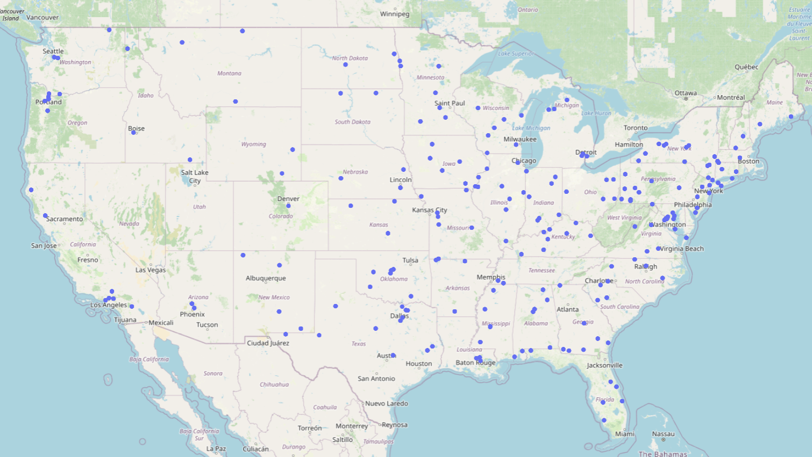
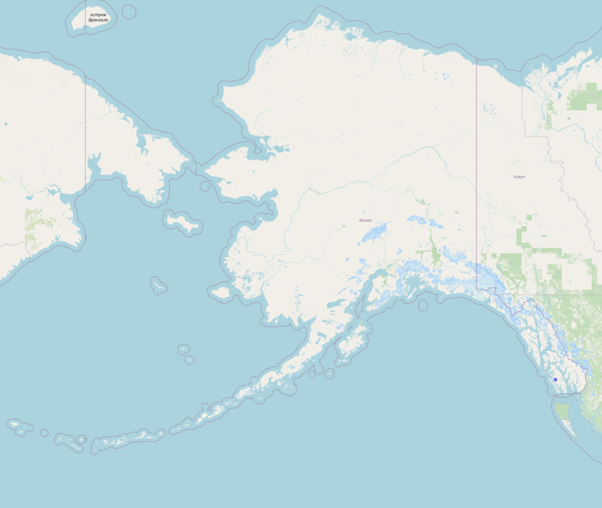
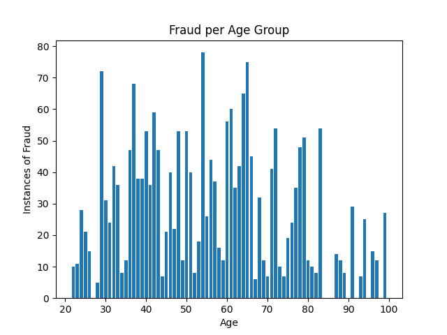
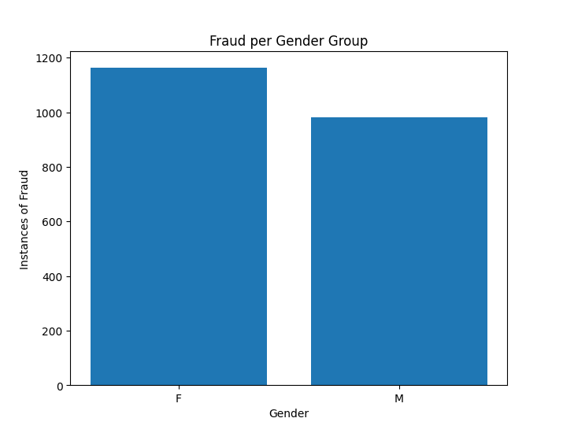
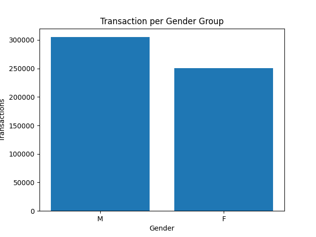
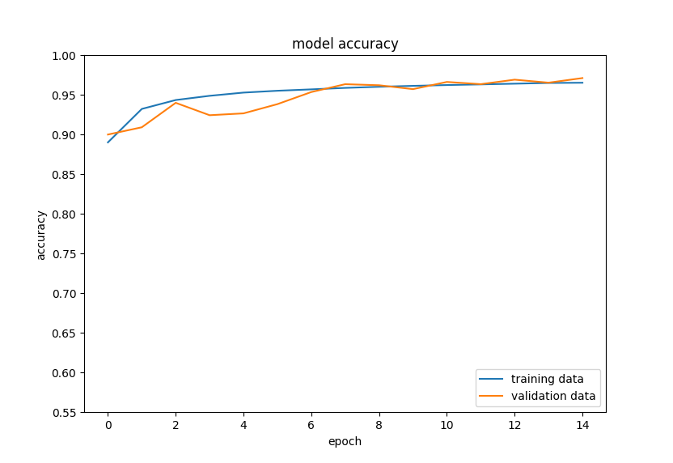
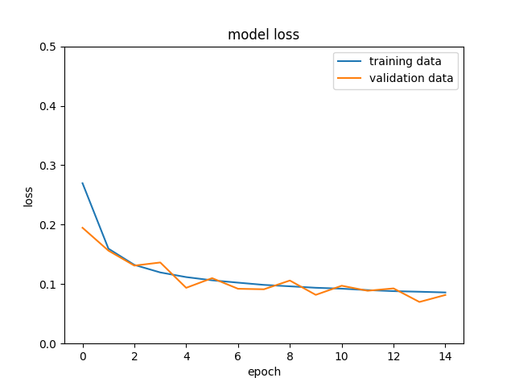

### Credit Card Fraudulent Purchases
This small project intends to look at a dataset that includes over 555,000 credit card transactions. Of these transactions, there are a little over 2,000 of which labeled as a "fraud".

##### Some Background Motivations

According to the FTC's [report](https://www.ftc.gov/system/files/ftc_gov/pdf/CSN%20Annual%20Data%20Book%202021%20Final%20PDF.pdf) from 2021, approximately 1.14% of all reported fraud in the US is Credit Card fraud, consisting of over 65,000 instances of Credit Card fraud. While the exact number of Credit Card transactions that occur in the US isn't an easily tracked statistic, much of what I could find suggests that fraud occures in less 1% of all Credit Card purchases. While the amount of fraud may be statistically low, the numbers have been steadily increasing in recent years. According the same report by the FTC, fraud in general has increased by over 1700% in the 20 years from 2001 to 2021. Much of this may have to do with the increase in Credit Card usage, the increase in Online Purchases made, and an increase in the use of the internet for fraud schemes.

Regardless, it is clear that fraudulent activities are on the rise. Aside from being a neusance, the FTC reports that 20% of fraud cases result in lost money, and over $2.3 billion was lost to fraudsters/scammers in 2021.

I've personally been the victim of Credit Card fraud at least once in my life, therefore analyzing some data related to the topic interests me.

##### Analyzing the Raw Data

Looking at the raw data I retrieved from [Kaggle](https://www.kaggle.com/datasets), we can see that the number of fraudulent purchases contained in the dataset is approximately 0.38%. Whilst I found many online sources stating that "less than 1%" of all Credit Card purchases made in the US are fraudulent, I was unable to find any credible sources that showed any statistics to state this for a fact. If we assume this is true, our data looks on-par with the statistics, but I cannot confirm these statistics for certain.

###### Maps

I decided to map the fraudulent transactions, just for fun.

The spread of data looks about like what I'd suspected. Low population areas like the West of the US, Alaska, and Hawaii (apart from major cities) have low instances of fraud. Higher population areas like the Mid-West & East Coast of the US have the lion's share of fraudulent transactions, which generally tracks alongside US population density.

###### Age Analysis

Additionally, we can see that there is no real trend relating the age of a fraud victim to the rate at which they fall ill of Credit Card fraud. It is a common belief that the eldery are more likely to be defrauded, but the data here suggests that they're the victims of Credit Card fraud about as often as other age groups.

###### Gender Analysis

Among those defrauded, we can see that people identifying as Female and people identifying as Male were defrauded at somewhat similar rates. Of the roughly 300k Male transactions, 0.33% were fraudulent. Of the roughly 260k female transactions, 0.43% were fraudulent. Both of these numbers fall within a very close margin of the total fraud of the dataset of 0.38%, with each gender falling about 1 standard deviation on either side of that value.

##### Fraud Prediction with Simple Learner
I wanted to setup a learner to predict fraudulent transactions using some simple machine learning methods. Using a sequential learner with Dense layers, we can get a model that performs relatively well, giving ~96% accuracy in testing to correctly predict fraudulent purchases.

The setup of the model is carried out in [fraud.py](fraud.py).